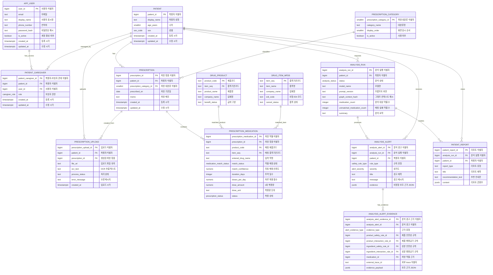
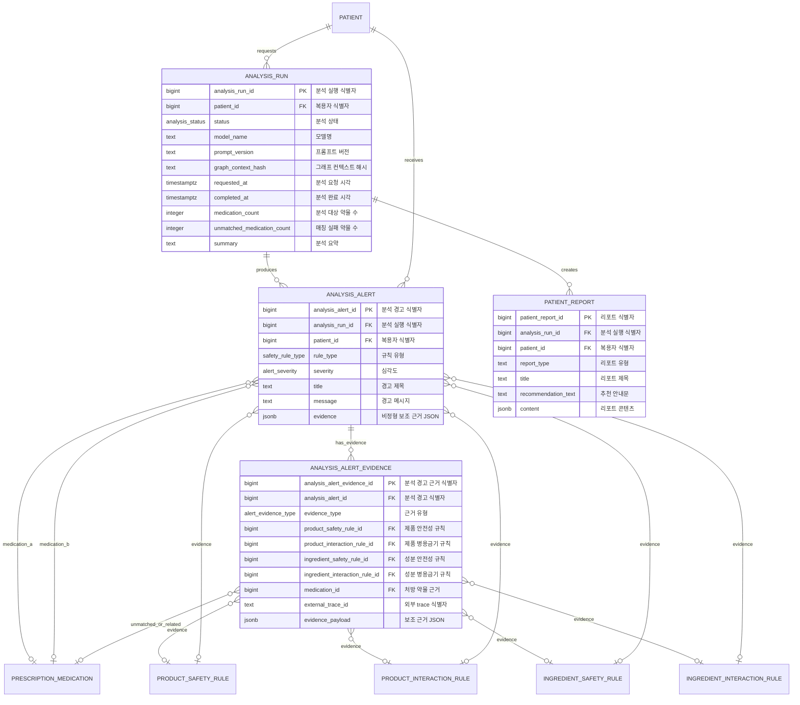

# 약손 AI ERD

이 문서는 `yakson_postgresql_schema.sql` 기준 ERD입니다. 전체 테이블을 한 장에 넣으면 읽기 어려워 앱 운영, 약물/DUR 마스터, 약물유전, 분석 결과 영역으로 나누었습니다.

Mermaid의 엔티티명은 실제 SQL 테이블명을 유지했고, 각 ERD 앞의 `테이블 한글명` 표에 한글명을 병기했습니다. 컬럼은 ERD 박스 안에서 `컬럼명 "한글 설명"` 형태로 바로 확인할 수 있습니다.

## 1. 앱 운영 ERD

테이블 한글명

| 테이블 | 한글명 |
| --- | --- |
| `APP_USER` | 사용자/보호자 계정 |
| `PATIENT` | 복용자 |
| `PATIENT_CAREGIVER` | 복용자-보호자 권한 |
| `PRESCRIPTION_CATEGORY` | 처방 대분류 |
| `PRESCRIPTION` | 처방 묶음 |
| `PRESCRIPTION_UPLOAD` | 처방전/약봉투 업로드 |
| `PRESCRIPTION_MEDICATION` | 처방 약물 상세 |
| `DRUG_PRODUCT` | 의약품 제품 마스터 |
| `DRUG_ITEM_MFDS` | 식약처 품목 마스터 |
| `ANALYSIS_RUN` | 분석 실행 이력 |
| `ANALYSIS_ALERT` | 분석 경고 |
| `ANALYSIS_ALERT_EVIDENCE` | 분석 경고 근거 |
| `PATIENT_REPORT` | 복용자 리포트 |

## 2. 약물/DUR 마스터 ERD

테이블 한글명

| 테이블 | 한글명 |
| --- | --- |
| `SOURCE_DATASET` | 원천 데이터셋 |
| `DRUG_ITEM_MFDS` | 식약처 품목 마스터 |
| `DRUG_PRODUCT` | 의약품 제품 마스터 |
| `INGREDIENT` | 성분 마스터 |
| `INGREDIENT_ALIAS` | 성분 별칭 |
| `DRUG_ITEM_MATERIAL` | 품목별 성분/함량 |
| `DRUG_PRODUCT_INGREDIENT` | 제품별 성분 매핑 |
| `INGREDIENT_DAILY_DOSE_LIMIT` | 성분별 1일 최대투여량 |
| `INGREDIENT_SAFETY_RULE` | 성분 안전성 규칙 |
| `INGREDIENT_INTERACTION_RULE` | 성분 병용금기 규칙 |
| `PRODUCT_SAFETY_RULE` | 제품 안전성 규칙 |
| `PRODUCT_INTERACTION_RULE` | 제품 병용금기 규칙 |
| `EFFICACY_GROUP` | 효능군 |
| `EFFICACY_GROUP_MEMBER` | 효능군 구성 약물 |

```mermaid
erDiagram
    SOURCE_DATASET ||--o{ DRUG_ITEM_MFDS : "loads"
    SOURCE_DATASET ||--o{ DRUG_PRODUCT : "loads"
    SOURCE_DATASET ||--o{ INGREDIENT : "loads"
    DRUG_ITEM_MFDS ||--o{ DRUG_PRODUCT : "matched_by_edi"
    DRUG_ITEM_MFDS ||--o{ DRUG_ITEM_MATERIAL : "has"
    INGREDIENT ||--o{ DRUG_ITEM_MATERIAL : "matches"
    DRUG_PRODUCT ||--o{ DRUG_PRODUCT_INGREDIENT : "has"
    INGREDIENT ||--o{ DRUG_PRODUCT_INGREDIENT : "included_in"
    INGREDIENT ||--o{ INGREDIENT_ALIAS : "has"
    INGREDIENT ||--o{ INGREDIENT_DAILY_DOSE_LIMIT : "limits"
    INGREDIENT ||--o{ INGREDIENT_SAFETY_RULE : "checked_by"
    INGREDIENT ||--o{ INGREDIENT_INTERACTION_RULE : "ingredient_a"
    INGREDIENT ||--o{ INGREDIENT_INTERACTION_RULE : "ingredient_b"
    DRUG_PRODUCT ||--o{ PRODUCT_SAFETY_RULE : "checked_by"
    INGREDIENT ||--o{ PRODUCT_SAFETY_RULE : "basis"
    DRUG_PRODUCT ||--o{ PRODUCT_INTERACTION_RULE : "product_a"
    DRUG_PRODUCT ||--o{ PRODUCT_INTERACTION_RULE : "product_b"
    INGREDIENT ||--o{ PRODUCT_INTERACTION_RULE : "ingredient_a"
    INGREDIENT ||--o{ PRODUCT_INTERACTION_RULE : "ingredient_b"
    EFFICACY_GROUP ||--o{ EFFICACY_GROUP_MEMBER : "contains"
    DRUG_PRODUCT ||--o{ EFFICACY_GROUP_MEMBER : "member_product"
    INGREDIENT ||--o{ EFFICACY_GROUP_MEMBER : "member_ingredient"

    SOURCE_DATASET {
        bigint source_dataset_id PK "원천 데이터셋 식별자"
        text source_file_name "원천 파일명"
        text source_provider "제공 기관"
        text source_category "원천 분류"
        text source_version "원천 버전"
        integer row_count "행 수"
        boolean is_selected_for_load "운영 적재 대상 여부"
    }

    DRUG_ITEM_MFDS {
        text item_seq PK "품목기준코드"
        text item_name "품목명"
        text company_name "업체명"
        text material_name_raw "성분/함량 원문"
        text edi_code "보험 EDI 코드"
        text type_name "DUR 유형명"
        bigint source_dataset_id FK "원천 데이터셋"
    }

    DRUG_PRODUCT {
        text product_code PK "제품코드"
        text item_seq FK "품목기준코드"
        text product_name "제품명"
        text normalized_product_name "정규화 제품명"
        text company_name "업체명"
        text benefit_status "급여 구분"
        date first_notice_date "최초 고시일"
        date last_notice_date "최근 고시일"
    }

    INGREDIENT {
        bigint ingredient_id PK "성분 식별자"
        text code_system "성분코드 체계"
        text ingredient_code "성분코드"
        text ingredient_name_ko "성분 한글명"
        text ingredient_name_en "성분 영문명"
        text canonical_name "대표 성분명"
        text mix_type "단일/복합 구분"
    }

    INGREDIENT_ALIAS {
        bigint ingredient_alias_id PK "성분 별칭 식별자"
        bigint ingredient_id FK "성분 식별자"
        text alias_name "별칭명"
        text language_code "언어 코드"
    }

    DRUG_ITEM_MATERIAL {
        bigint drug_item_material_id PK "품목 성분 식별자"
        text item_seq FK "품목기준코드"
        bigint ingredient_id FK "성분 식별자"
        text material_name "성분명"
        numeric amount_value "함량 수치"
        text amount_unit "함량 단위"
        text raw_material_text "성분/함량 원문"
    }

    DRUG_PRODUCT_INGREDIENT {
        text product_code PK "제품코드"
        bigint ingredient_id PK "성분 식별자"
        text ingredient_name_at_source "원천 성분명"
        text source_row_hash "원천 행 해시"
    }

    INGREDIENT_DAILY_DOSE_LIMIT {
        bigint dose_limit_id PK "최대투여량 식별자"
        bigint ingredient_id FK "성분 식별자"
        text form_code "제형 코드"
        text form_name "제형명"
        text dosage_route_code "투여경로 코드"
        numeric max_daily_quantity "1일 최대투여량"
        text max_daily_unit "최대투여량 단위"
    }

    INGREDIENT_SAFETY_RULE {
        bigint ingredient_safety_rule_id PK "성분 안전성 규칙 식별자"
        safety_rule_type rule_type "규칙 유형"
        bigint ingredient_id FK "성분 식별자"
        text pregnancy_grade "임부금기 등급"
        text age_base_text "연령 기준 원문"
        text max_quantity_text "최대 용량 원문"
        text max_duration_text "최대 투여기간 원문"
        text prohibited_content "금기/주의 내용"
        date notice_date "고시/공고일"
    }

    INGREDIENT_INTERACTION_RULE {
        bigint ingredient_interaction_rule_id PK "성분 병용금기 규칙 식별자"
        bigint ingredient_a_id FK "성분 A 식별자"
        bigint ingredient_b_id FK "성분 B 식별자"
        text prohibited_content "병용금기 내용"
        text remark "비고"
        date notice_date "고시/공고일"
    }

    PRODUCT_SAFETY_RULE {
        bigint product_safety_rule_id PK "제품 안전성 규칙 식별자"
        safety_rule_type rule_type "규칙 유형"
        text product_code FK "제품코드"
        bigint ingredient_id FK "성분 식별자"
        text pregnancy_grade "임부금기 등급"
        numeric age_value "연령 기준 수치"
        text age_unit "연령 단위"
        numeric max_daily_dose_value "1일 최대 투여기준량"
        integer max_duration_days "최대 투여기간 일수"
        text detail_info "상세 정보"
    }

    PRODUCT_INTERACTION_RULE {
        bigint product_interaction_rule_id PK "제품 병용금기 규칙 식별자"
        text product_code_a FK "제품 A 코드"
        text product_code_b FK "제품 B 코드"
        bigint ingredient_a_id FK "성분 A 식별자"
        bigint ingredient_b_id FK "성분 B 식별자"
        text notice_no "고시/공고번호"
        date notice_date "고시/공고일"
        text contraindication_reason "병용금기 사유"
    }

    EFFICACY_GROUP {
        bigint efficacy_group_id PK "효능군 식별자"
        text efficacy_group_name "효능군명"
        text group_category "그룹 구분"
    }

    EFFICACY_GROUP_MEMBER {
        bigint efficacy_group_member_id PK "효능군 멤버 식별자"
        bigint efficacy_group_id FK "효능군 식별자"
        text product_code FK "제품코드"
        bigint ingredient_id FK "성분 식별자"
        text generic_name_code "일반명코드"
        text benefit_status "급여 구분"
    }
```

## 3. 약물유전정보 ERD

테이블 한글명

| 테이블 | 한글명 |
| --- | --- |
| `PGX_DRUG` | 약물유전 약물 |
| `PGX_GENE` | 약물유전 유전자 |
| `PGX_DRUG_GENE` | 약물-유전자 관계 |
| `PGX_DRUG_LABEL_INFO` | 약물유전 라벨 정보 |
| `PGX_TEST_REAGENT` | 약물유전자 검사 시약 |
| `PGX_KOREAN_EVIDENCE` | 한국인 약물유전 근거 |
| `PGX_FOREIGN_GUIDELINE_SUMMARY` | 해외 약물유전 가이드 요약 |
| `SOURCE_DATASET` | 원천 데이터셋 |

```mermaid
erDiagram
    PGX_DRUG ||--o{ PGX_DRUG_LABEL_INFO : "has"
    PGX_DRUG ||--o{ PGX_DRUG_GENE : "related"
    PGX_GENE ||--o{ PGX_DRUG_GENE : "related"
    PGX_DRUG ||--o{ PGX_KOREAN_EVIDENCE : "has"
    PGX_DRUG ||--o{ PGX_FOREIGN_GUIDELINE_SUMMARY : "has"
    PGX_DRUG ||--o{ PGX_TEST_REAGENT : "tested_by"
    PGX_GENE ||--o{ PGX_TEST_REAGENT : "tested_by"
    SOURCE_DATASET ||--o{ PGX_DRUG_LABEL_INFO : "loads"
    SOURCE_DATASET ||--o{ PGX_DRUG_GENE : "loads"
    SOURCE_DATASET ||--o{ PGX_TEST_REAGENT : "loads"
    SOURCE_DATASET ||--o{ PGX_KOREAN_EVIDENCE : "loads"
    SOURCE_DATASET ||--o{ PGX_FOREIGN_GUIDELINE_SUMMARY : "loads"

    PGX_DRUG {
        bigint pgx_drug_id PK "약물유전 약물 식별자"
        text drug_name_ko "약물 한글명"
        text drug_name_en "약물 영문명"
        text canonical_name "대표 약물명"
    }

    PGX_GENE {
        bigint pgx_gene_id PK "유전자 식별자"
        text gene_name "유전자명"
        text main_gene_name "대표 유전자명"
    }

    PGX_DRUG_GENE {
        bigint pgx_drug_gene_id PK "약물-유전자 관계 식별자"
        bigint pgx_drug_id FK "약물유전 약물 식별자"
        bigint pgx_gene_id FK "유전자 식별자"
        text source_row_hash "원천 행 해시"
    }

    PGX_DRUG_LABEL_INFO {
        bigint pgx_drug_label_info_id PK "라벨 정보 식별자"
        bigint pgx_drug_id FK "약물유전 약물 식별자"
        text basic_info "기본정보"
        text general_info "일반정보"
        text product_names "관련 품목명"
    }

    PGX_TEST_REAGENT {
        bigint pgx_test_reagent_id PK "검사 시약 식별자"
        bigint pgx_drug_id FK "매칭 약물 식별자"
        bigint pgx_gene_id FK "매칭 유전자 식별자"
        text related_drug_name "관련 약물명"
        text reagent_name "시약명"
        text related_gene_name "관련 유전자명"
        text purpose_content "사용 목적"
    }

    PGX_KOREAN_EVIDENCE {
        bigint pgx_korean_evidence_id PK "한국인 근거 식별자"
        bigint pgx_drug_id FK "약물유전 약물 식별자"
        text biomarker_indicator_value "바이오마커 지표값"
        text approval_summary "허가사항 요약"
    }

    PGX_FOREIGN_GUIDELINE_SUMMARY {
        bigint pgx_foreign_guideline_summary_id PK "해외 가이드 요약 식별자"
        bigint pgx_drug_id FK "약물유전 약물 식별자"
        text us_summary_code "미국 요약 코드"
        text eu_summary_code "유럽 요약 코드"
        text japan_summary_code "일본 요약 코드"
    }

    SOURCE_DATASET {
        bigint source_dataset_id PK "원천 데이터셋 식별자"
        text source_file_name "원천 파일명"
        text source_category "원천 분류"
        text source_version "원천 버전"
    }
```

## 4. 분석 결과/근거 연결 ERD

테이블 한글명

| 테이블 | 한글명 |
| --- | --- |
| `PATIENT` | 복용자 |
| `ANALYSIS_RUN` | 분석 실행 이력 |
| `ANALYSIS_ALERT` | 분석 경고 |
| `ANALYSIS_ALERT_EVIDENCE` | 분석 경고 근거 |
| `PRESCRIPTION_MEDICATION` | 처방 약물 상세 |
| `PRODUCT_SAFETY_RULE` | 제품 안전성 규칙 |
| `PRODUCT_INTERACTION_RULE` | 제품 병용금기 규칙 |
| `INGREDIENT_SAFETY_RULE` | 성분 안전성 규칙 |
| `INGREDIENT_INTERACTION_RULE` | 성분 병용금기 규칙 |
| `PATIENT_REPORT` | 복용자 리포트 |

## 구현을 위해 추가 확보하면 좋은 데이터

### 필수에 가까운 데이터

| 필요 데이터 | 필요한 이유 | 반영 위치 |
| --- | --- | --- |
| 생년월일 또는 기준일 포함 나이 | 현재 `age_years`만 있으면 시간이 지나도 나이가 자동 갱신되지 않습니다. 연령금기 판단에는 생년월일이 더 안전합니다. | `patient.birth_date` 추가 권장 |
| 임신 여부, 임신 주수, 수유 여부 | 임부금기/수유부주의 규칙은 환자 상태가 있어야 실제 경고로 전환됩니다. | `patient_clinical_context` 또는 `patient` 확장 |
| 알레르기/과민반응 정보 | 약물 안전 점검에서 매우 기본적인 개인 위험 요소입니다. | `patient_allergy` 신규 |
| 질환/진단/기저질환 | 노인주의, 운동 리포트, 식습관 리포트의 개인화에 필요합니다. 예: 고혈압, 당뇨, 신장질환, 간질환, 낙상위험 | `patient_condition` 신규 |
| 신장/간 기능 수치 | 용량 조절과 노인 약물 위험 평가에 중요합니다. 예: eGFR, CrCl, AST/ALT | `patient_lab_result` 신규 |
| 약물 복용 시작일/종료일/복용 시간대 | 병용 여부와 중복 복용 여부를 정확히 판단하려면 기간 겹침이 필요합니다. | `prescription_medication.start_date`, `end_date`, `schedule_text` 추가 권장 |
| 용량 단위 표준화 테이블 | `정`, `캡슐`, `mL`, `mg`를 비교하려면 단위 변환 규칙이 필요합니다. | `dose_unit`, `unit_conversion` 신규 |
| 제품코드-품목기준코드 매핑 보완 데이터 | 현재 제품코드는 `DUR품목정보.EDI_CODE`와 일부만 매칭됩니다. 검색/자동완성 정확도를 높이려면 매핑률 보강이 필요합니다. | `drug_product.item_seq` 매칭 보강 |
| 약물명 동의어/오타/성분명 매핑 | 사용자가 직접 입력한 약명을 제품코드로 찾기 위해 필요합니다. | `drug_name_alias` 신규 또는 `ingredient_alias` 확장 |

### AI/GraphRAG 품질을 위해 필요한 데이터

| 필요 데이터 | 필요한 이유 | 반영 위치 |
| --- | --- | --- |
| 약물-음식 상호작용 데이터 | 식습관 리포트의 핵심 근거입니다. 현재 CSV에는 자몽주스 같은 식품 상호작용 지식이 충분하지 않습니다. | Graph DB 우선, RDB에는 `food_interaction_reference` 가능 |
| 약물-운동/활동 주의 데이터 | 운동 리포트 생성에 필요합니다. 예: 어지러움, 낙상, 탈수, 근육병증과 활동 제한 | Graph DB 우선 |
| 약물 부작용 데이터 | 운동/생활 가이드와 경고 설명을 만들 때 필요합니다. | Graph DB 우선, RDB 보조 마스터 가능 |
| 경고 심각도/우선순위 기준 | 원천 금기 사유만으로는 화면의 `위험/주의/정상` 등급을 일관되게 산정하기 어렵습니다. | `rule_severity_policy` 신규 |
| 임상 근거 출처/버전 | LLM 답변의 출처 검증과 업데이트 추적에 필요합니다. | `source_dataset`, Graph node metadata |
| OCR 학습/검증 샘플 | 약봉투/처방전 사진 입력을 구현하려면 실제 이미지와 정답 라벨이 필요합니다. | 파일 저장소 + `prescription_upload` 확장 |
| 분석 정답/평가 데이터셋 | AI 경고가 과소/과다 탐지되는지 검증하려면 샘플 처방과 기대 경고가 필요합니다. | `analysis_eval_case` 신규 |

### 서비스 운영을 위해 추가 검토할 데이터

| 필요 데이터 | 필요한 이유 |
| --- | --- |
| 개인정보 동의/감사 로그 | 의료/복약 정보는 민감정보라 동의 이력과 조회/변경 로그가 필요합니다. |
| 원천 데이터 업데이트 주기/배치 로그 | DUR 데이터는 갱신되므로 적재 성공/실패와 버전 관리가 필요합니다. |
| 사용자 피드백 데이터 | 경고가 맞았는지, 숨겼는지, 의사와 상의했는지 저장하면 품질 개선에 도움이 됩니다. |

## 우선순위 제안

1. 먼저 `생년월일`, `임신/수유 여부`, `복용 시작/종료일`, `약명 alias`, `제품코드 매핑 보강`을 확보하는 것이 좋습니다.
2. 식습관/운동 리포트를 실제 기능으로 낼 계획이면 `약물-음식`, `약물-부작용`, `부작용-운동주의` 데이터가 별도로 필요합니다.
3. 운영 서비스로 갈 경우 이미 반영한 `app_user`, `patient_caregiver`를 기준으로 `동의 이력`, `감사 로그`, `원천 데이터 배치 로그`를 초기에 이어 붙이는 편이 안전합니다.
